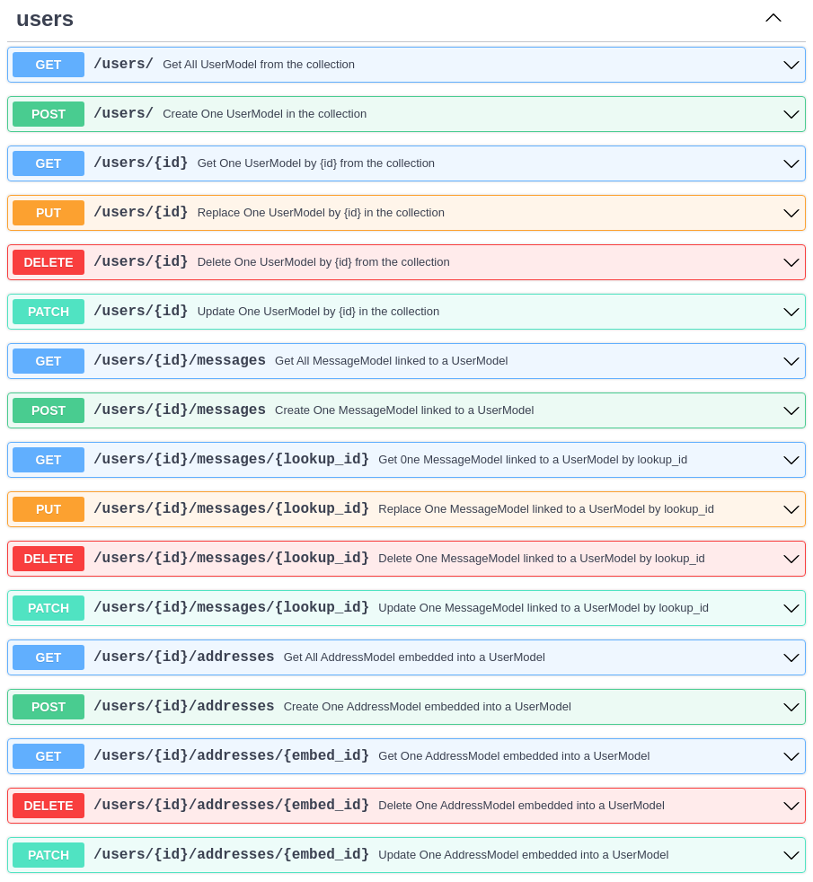

This is a minimalist example of a FastAPI application build with FastAPI CRUDRouter for Mongodb :seedling:.

I'm working on differents examples, with some custom router besides the CRUDRouter, and I will add them to the documentation soon :rocket:.

```py linenums="1"
from datetime import datetime
from typing import Optional, Union, Annotated
from fastapi import FastAPI
from fastapi_crudrouter_mongodb import (
    ObjectId,
    MongoObjectId,
    MongoModel,
    CRUDRouter,
    CRUDLookup,
    CRUDEmbed,
)
import motor.motor_asyncio


# Database connection using motor
client = motor.motor_asyncio.AsyncIOMotorClient("mongodb://localhost:27017/local")

# store the database in a global variable
db = client.local


# Database Model
class MessageModel(MongoModel):
    id: Annotated[ObjectId, MongoObjectId] | None = None
    message: str
    user_id: Annotated[ObjectId, MongoObjectId]
    created_at: str | None = datetime.now().strftime("%Y-%m-%d %H:%M:%S")
    updated_at: str | None = datetime.now().strftime("%Y-%m-%d %H:%M:%S")


class AddressModel(MongoModel):
    id: Annotated[ObjectId, MongoObjectId] | None = None
    street: str
    city: str
    state: str
    zip: str


class UserModel(MongoModel):
    id: Annotated[ObjectId, MongoObjectId] | None = None
    name: str
    email: str
    password: str
    addresses: Optional[list[AddressModel]] = []
    messages: Optional[Union[list[MessageModel], MessageModel]] = None

# Model Out -> Schema
class UserModelOut(MongoModel):
    id: str
    name: str
    email: str
    addresses: list[AddressModel] = []


class LookupModelOut(UserModelOut):
    messages: list[MessageModel] | MessageModel


# Instantiating the CRUDRouter, and a lookup for the messages
# a User is a model that contains a list of embedded addresses and related to multiple messages
addresses_embed = CRUDEmbed(model=AddressModel, embed_name="addresses")

messages_lookup = CRUDLookup(
    model=MessageModel,
    model_out=LookupModelOut,
    collection_name="messages",
    prefix="messages",
    local_field="_id",
    foreign_field="user_id",
)

users_router = CRUDRouter(
    model=UserModel,
    model_out=UserModelOut,
    db=db,
    collection_name="users",
    lookups=[messages_lookup],
    embeds=[addresses_embed],
    prefix="/users",
    tags=["users"],
)

# Instantiating the FastAPI app
app = FastAPI()
app.include_router(users_router)
```

It will give you the following OpenAPI schema:



