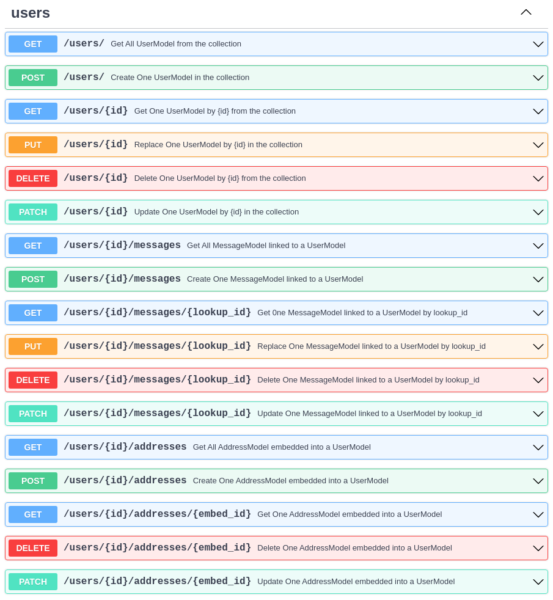

This example shows a small but complete FastAPI application built with fastapi-crudrouter-mongodb.

It keeps the setup intentionally small while still showing two common patterns:

- embedded documents with `CRUDEmbed`
- nested child routes with `CRUDLookup`

```py linenums="1"
from datetime import datetime
from typing import Optional, Union

from fastapi import FastAPI
from pydantic import Field
from fastapi_crudrouter_mongodb import (
    ObjectIdType,
    MongoModel,
    CRUDRouter,
    CRUDLookup,
    CRUDEmbed,
)
import motor.motor_asyncio


# Database connection using motor
client = motor.motor_asyncio.AsyncIOMotorClient("mongodb://localhost:27017/local")

# store the database in a global variable
db = client.local


# Database Model
class MessageModel(MongoModel):
    id: ObjectIdType | None = None
    message: str
    user_id: ObjectIdType
    created_at: str | None = datetime.now().strftime("%Y-%m-%d %H:%M:%S")
    updated_at: str | None = datetime.now().strftime("%Y-%m-%d %H:%M:%S")


class AddressModel(MongoModel):
    id: ObjectIdType | None = None
    street: str
    city: str
    state: str
    zip: str


class UserModel(MongoModel):
    id: ObjectIdType | None = None
    name: str
    email: str
    password: str
    addresses: Optional[list[AddressModel]] = Field(default_factory=list)
    messages: Optional[Union[list[MessageModel], MessageModel]] = None


# Model Out -> Schema
class UserModelOut(MongoModel):
    id: str
    name: str
    email: str
    addresses: list[AddressModel] = Field(default_factory=list)


# A user embeds addresses and is linked to many messages.
addresses_embed = CRUDEmbed(model=AddressModel, embed_name="addresses")

messages_lookup = CRUDLookup(
    model=MessageModel,
    collection_name="messages",
    prefix="messages",
    local_field="_id",
    foreign_field="user_id",
)

users_router = CRUDRouter(
    model=UserModel,
    model_out=UserModelOut,
    db=db,
    collection_name="users",
    lookups=[messages_lookup],
    embeds=[addresses_embed],
    prefix="/users",
    tags=["users"],
)

# Instantiating the FastAPI app
app = FastAPI()
app.include_router(users_router)
```

This generates standard user CRUD routes plus nested message routes such as:

- `GET /users`
- `POST /users`
- `GET /users/{id}`
- `GET /users/{id}/messages`
- `POST /users/{id}/messages`

It will produce an OpenAPI schema similar to this:



