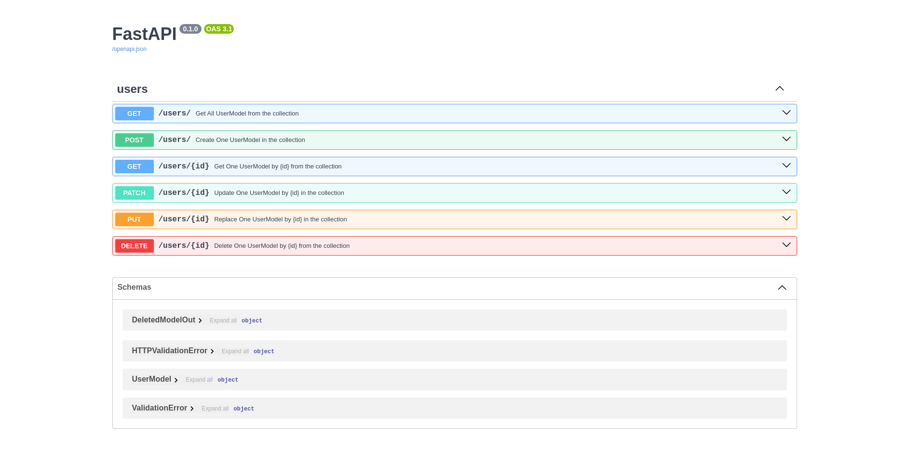
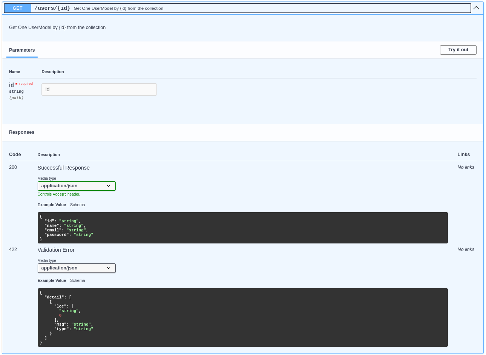

<p align="center">
  
</p>
<p align="center">
  <em>⚡ Instant CRUD APIs from Pydantic Models</em> ⚡</br>
  <sub>Build a fully working FastAPI CRUD API in 10 seconds.</sub>
</p>

---

## 🚀 10-second example

<div class="termy">
```console
$ pip install fastapi-crudrouter-mongodb
---> 100%
```
</div>

```py
from fastapi import FastAPI
import motor.motor_asyncio
from fastapi_crudrouter_mongodb import (
    ObjectIdType,
    MongoModel,
    CRUDRouter,
)

# Database connection using motor
client = motor.motor_asyncio.AsyncIOMotorClient("mongodb://localhost:27017/local")

# store the database in a global variable
db = client.local

# Database Model
class UserModel(MongoModel):
    id: ObjectIdType | None = None
    name: str
    email: str

# Instantiating the CRUDRouter
users_router = CRUDRouter(
    model=UserModel,
    db=db,
    collection_name="users",
    prefix="/users",
    tags=["users"],
)

# Instantiating the FastAPI app
app = FastAPI()
app.include_router(users_router)
```

## ✨ What you get instantly

|HTTP Verb|Path|Description|
|------|------|------|
|`GET` | /users | `List all users` |
|`POST` | /users | `Create a new user` |
|`GET` | /users/{id} | `Get a user by id` |
|`PUT` | /users/{id} | `Update a user by id` |
|`PATCH` | /users/{id} | `Partially update a  user by id` |
|`DELETE` | /users/{id} | `Delete a user by id` |

!!!tip "No routing. No boilerplate. No repetition."
    The CRUDRouter automatically generates all the necessary routes for your models.

---

## 🔥 Why this exists

FastAPI is great, but CRUD is repetitive.

This library removes the boring parts so you can focus on your product.


## ⚡ Get started

👉 Jump to the [Quickstart](https://pierrod.github.io/fastapi-crudrouter-mongodb-doc/quickstart) in 2 minutes


---


## OpenAPI Support

!!! tip "Automatic OpenAPI Documentation"
    By default, the CRUDRouter automatically documents all generated routes in accordance with the OpenAPI specification.





The CRUDRouter can dynamically generate comprehensive documentation based on the provided models.




---

**Credits** :
- [FastAPI](https://fastapi.tiangolo.com)

- Base projet and idea : [awtkns](https://github.com/awtkns/fastapi-crudrouter)

- Convert \_id to id (for previous versions of Pydantic) : [mclate github guide](https://github.com/tiangolo/fastapi/issues/1515)

- For Pydantic v2 : [Stackoverflow](https://stackoverflow.com/questions/76686267/what-is-the-new-way-to-declare-mongo-objectid-with-pydantic-v2-0)

- [Source code on github](https://github.com/pierrod/fastapi-crudrouter-mongodb)