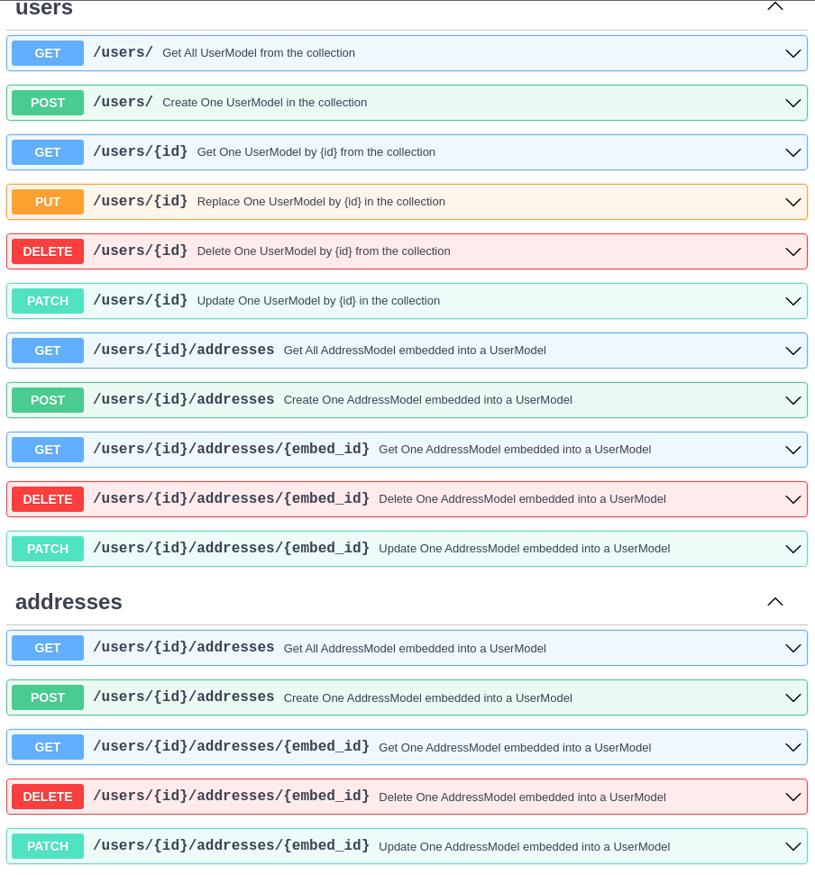

# CRUDEmbed

**CRUDEmbed** is a configuration object used by `CRUDRouter` to define an embedded field on a parent model.

It does not manage embedded documents by itself. Instead, you pass it to `CRUDRouter(embeds=[...])`, and the router layer uses that configuration when exposing routes for embedded data.

## Constructor

```python
CRUDEmbed(model, embed_name)
```

The current implementation stores two values:

- `model`: the embedded model class
- `embed_name`: the field name on the parent model that contains the embedded documents

Use it when child data is stored directly inside the parent record, for example `addresses` inside a `user`, instead of in a separate collection.

## When to Use CRUDEmbed

Choose CRUDEmbed when:

- your data is naturally nested inside one parent document
- you want one-to-many style data without creating a separate child collection
- you prefer embedded structure over lookup/populate relationships

## Key Point

Embeds are **not auto-detected**. You must define them explicitly and pass them to `CRUDRouter`.

## Parameters

- `model`: embedded model class
- `embed_name`: name of the field on the parent model that stores embedded items

## Quick Setup

```python
from typing import Optional

from pydantic import Field
from fastapi_crudrouter_mongodb import (
    CRUDEmbed,
    CRUDRouter,
    MongoModel,
    ObjectIdType,
)


class AddressModel(MongoModel):
    id: ObjectIdType | None = None
    street: str
    zip_code: str


class UserModel(MongoModel):
    id: ObjectIdType | None = None
    name: str
    addresses: Optional[list[AddressModel]] = Field(default_factory=list)


addresses_embed = CRUDEmbed(
    model=AddressModel,
    embed_name="addresses",
)


users_router = CRUDRouter(
    model=UserModel,
    db=db,
    collection_name="users",
    embeds=[addresses_embed],
    prefix="/users",
    tags=["users"],
)
```

## Output Schema

If you use `model_out`, include the embedded field there as well so your API responses expose the embedded data clearly.

```python
from pydantic import Field


class UserModelOut(MongoModel):
    id: str
    name: str
    addresses: list[AddressModel] = Field(default_factory=list)
```

## What `CRUDEmbed` Defines

When passed to `CRUDRouter`, a `CRUDEmbed` object defines:

- which embedded model is used
- which parent field contains the embedded documents
- which embedded field `CRUDRouter` should expose through its embed support

In the example above, `embed_name="addresses"` tells the router that `UserModel.addresses` holds embedded `AddressModel` items.

## Parent Model Expectations

In practice, the parent model should expose the embedded field using the same name as `embed_name`.

```python
class UserModel(MongoModel):
    id: ObjectIdType | None = None
    name: str
    addresses: list[AddressModel] = Field(default_factory=list)
```

Keeping the field name aligned with `embed_name` is what allows `CRUDRouter` to connect the embed configuration to the correct parent field.

## Notes

- The current `CRUDEmbed` class is a simple container for embed configuration.
- The class itself does not validate constructor input.
- Route generation happens when the object is passed to `CRUDRouter`.

!!! tip "Route Naming"
    Use plural resource names in prefixes for clearer REST-style URLs.

## OpenAPI Documentation

Embedded routes generated through `CRUDRouter` are included in the normal FastAPI OpenAPI output.



## Related Features

- [CRUDRouter](CRUDRouter.md): base router and shared options
- [CRUDLookup](CRUDLookup.md): nested routes with separate child collection
- [CRUDPopulate](CRUDPopulate.md): resolve referenced ids into full documents
