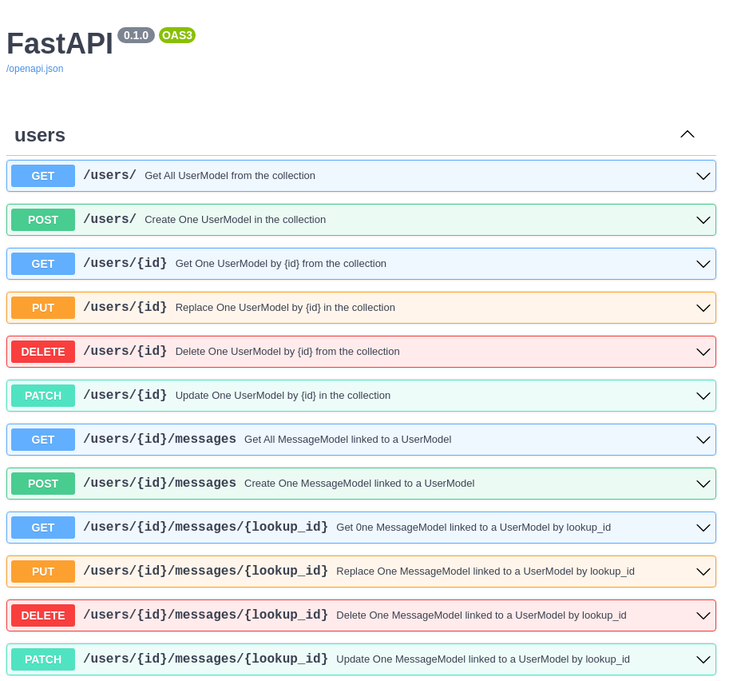

# CRUDLookup

**CRUDLookup** is a configuration object used by `CRUDRouter` to define a related child collection.

It does not create routes by itself. Instead, you pass it to `CRUDRouter(lookups=[...])`, and the router layer uses that configuration to build nested child routes.

## Constructor

```python
CRUDLookup(
    model: MongoModel,
    model_out: MongoModel,
    collection_name: str,
    prefix: str,
    local_field: str,
    foreign_field: str,
)
```

When used with `CRUDRouter`, it is intended for parent-child relationships such as:

- `/users/{id}/messages`
- `/users/{id}/messages/{lookup_id}`

## When to Use CRUDLookup

CRUDLookup is useful when:

- child documents are stored in a separate collection
- each child references its parent with a foreign key (for example, `user_id`)
- you want nested REST endpoints without writing all child routes manually

## Parameters

- `model`: child model class used for lookup documents
- `model_out`: output model used for lookup responses
- `collection_name`: MongoDB collection containing child documents
- `prefix`: nested route segment used in URLs
- `local_field`: parent field used for matching, often `_id`
- `foreign_field`: child field pointing back to the parent id

All constructor arguments are required in the current implementation.

## Parent Model Shape

When using lookups with `CRUDRouter`, the parent model is typically shaped to expose either a list of child documents or a single child document:

```python
from typing import Optional, Union
from fastapi_crudrouter_mongodb import MongoModel, ObjectIdType


class ChildModel(MongoModel):
    id: ObjectIdType | None = None
    parent_id: ObjectIdType


class ParentModel(MongoModel):
    id: ObjectIdType | None = None
    childs: Optional[Union[list[ChildModel], ChildModel]] = None
```

This shape is useful because:

- list form supports routes returning many children, such as `/parents/{id}/childrens`
- single object form supports routes returning one child, such as `/parents/{id}/childrens/{lookup_id}`

## Quick Setup

```python
from typing import Optional, Union
from fastapi_crudrouter_mongodb import (
    CRUDLookup,
    CRUDRouter,
    MongoModel,
    ObjectIdType,
)


class ChildModel(MongoModel):
    id: ObjectIdType | None = None
    parent_id: ObjectIdType


class ChildModelOut(MongoModel):
    id: str
    parent_id: str


class ParentModel(MongoModel):
    id: ObjectIdType | None = None
    childs: Optional[Union[list[ChildModel], ChildModel]] = None


child_lookup = CRUDLookup(
    model=ChildModel,
    model_out=ChildModelOut,
    collection_name="childrens",
    prefix="childrens",
    local_field="_id",
    foreign_field="parent_id",
)

parents_router = CRUDRouter(
    model=ParentModel,
    db=db,
    collection_name="parents",
    lookups=[child_lookup],
    prefix="/parents",
    tags=["parents"],
)
```

## Output Schemas

`CRUDLookup` requires a `model_out` argument in the current implementation.

Use it to control the response shape returned by nested lookup routes.

- hide sensitive fields from child responses
- return ids as strings instead of raw MongoDB values
- keep nested route responses separate from the database model shape

```python
from datetime import datetime
from typing import Optional, Union
from fastapi_crudrouter_mongodb import CRUDLookup, CRUDRouter, MongoModel, ObjectIdType


class MessageModel(MongoModel):
    id: ObjectIdType | None = None
    message: str
    user_id: ObjectIdType
    created_at: str | None = datetime.now().strftime("%Y-%m-%d %H:%M:%S")
    updated_at: str | None = datetime.now().strftime("%Y-%m-%d %H:%M:%S")


class UserModel(MongoModel):
    id: ObjectIdType | None = None
    name: str
    email: str
    password: str
    messages: Optional[Union[list[MessageModel], MessageModel]] = None


class MessageModelOut(MongoModel):
    id: str
    message: str
    user_id: str


messages_lookup = CRUDLookup(
    model=MessageModel,
    model_out=MessageModelOut,
    collection_name="messages",
    prefix="messages",
    local_field="_id",
    foreign_field="user_id",
)

users_router = CRUDRouter(
    model=UserModel,
    db=db,
    collection_name="users",
    lookups=[messages_lookup],
    prefix="/users",
    tags=["users"],
)
```

## What `CRUDLookup` Defines

When passed to `CRUDRouter`, a `CRUDLookup` object defines:

- which child model is used
- which output model is used for child responses
- which child collection is queried
- which URL segment is used for nested routes
- how the parent and child documents are matched

In the example above:

- `prefix="messages"` produces nested routes under `/users/{id}/messages`
- `local_field="_id"` means the parent user id is the local match field
- `foreign_field="user_id"` means each message points back to the user through `user_id`

## Typical Nested Routes

When one lookup is attached to a router, the resulting API commonly includes routes like these:

| Route                                 | Method   | Description                                  |
| ------------------------------------- | -------- | -------------------------------------------- |
| `/parents`                            | `GET`    | Get all parent documents                     |
| `/parents`                            | `POST`   | Create a parent document                     |
| `/parents/{id}`                       | `GET`    | Get a parent document by id                  |
| `/parents/{id}`                       | `PUT`    | Replace a parent document by id              |
| `/parents/{id}`                       | `PATCH`  | Partially update a parent document by id     |
| `/parents/{id}`                       | `DELETE` | Delete a parent document by id               |
| `/parents/{id}/childrens`             | `GET`    | Get all children for a parent                |
| `/parents/{id}/childrens/{lookup_id}` | `GET`    | Get one child for a parent                   |
| `/parents/{id}/childrens`             | `POST`   | Create a child under a parent                |
| `/parents/{id}/childrens/{lookup_id}` | `PUT`    | Replace a child by id and lookup id          |
| `/parents/{id}/childrens/{lookup_id}` | `PATCH`  | Partially update a child by id and lookup id |
| `/parents/{id}/childrens/{lookup_id}` | `DELETE` | Delete a child by id and lookup id           |

!!! tip "Route Naming"
    Use plural prefixes (for example, `/parents`, `/messages`) for cleaner REST-style URLs.

## Notes

- The current `CRUDLookup` class is a simple container for lookup configuration.
- The class itself does not validate parameter values.
- Route generation happens when the object is passed to `CRUDRouter`.

## OpenAPI Documentation

Nested routes generated through `CRUDRouter` are included in the normal FastAPI OpenAPI output.



## Related Features

- [CRUDRouter](CRUDRouter.md): base CRUD routes and router-level options
- [CRUDPopulate](CRUDPopulate.md): resolve referenced ids into full documents in responses
- [CRUDEmbed](CRUDEmbed.md): work with embedded models
