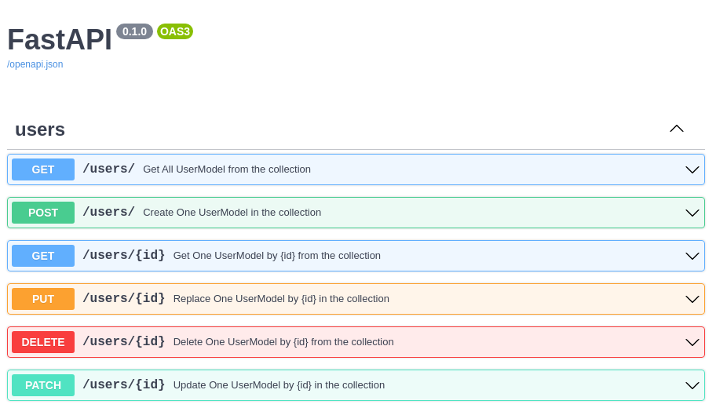

# CRUDRouter

The **CRUDRouter** is a powerful utility that automatically generates all the standard REST API routes (Create, Read, Update, Delete) for your MongoDB models. Simply pass your model and database instance, and it will create fully-documented, production-ready endpoints for you.

## Quick Start

To create a basic router, initialize it with your model and database:

```python
CRUDRouter(
    model=MyMongoModel,
    db=MyDbInstance,
    collection_name="my_collection_name",
    prefix="/my_prefix",
)
```

The router will automatically generate six REST endpoints to manage your data. No boilerplate code required!

## Constructor Parameters

The current `CRUDRouter` implementation accepts these primary parameters:

- `model`: MongoDB model used for request validation
- `db`: Motor database instance
- `collection_name`: MongoDB collection name
- `identifier_field`: field used in item routes, default `_id`
- `model_out`: optional response schema
- `lookups`: optional list of `CRUDLookup` declarations
- `embeds`: optional list of `CRUDEmbed` declarations
- `populates`: optional list of `CRUDPopulate` declarations
- `disable_get_all`, `disable_get_one`, `disable_create_one`, `disable_replace_one`, `disable_update_one`, `disable_delete_one`: disable individual generated routes
- `dependencies_get_all`, `dependencies_get_one`, `dependencies_create_one`, `dependencies_replace_one`, `dependencies_update_one`, `dependencies_delete_one`: attach FastAPI dependencies to specific generated routes
- `filter_dependency`: dependency that returns a server-side filter for the `GET /resource` route

Additional `*args` and `**kwargs` are passed through to the underlying router factory.

## Output Schemas (Hide Sensitive Data)

When you create an API, you might store sensitive information in your database (like passwords) that you don't want to expose in API responses. The CRUDRouter lets you define separate **input** and **output** models:

- **Input Model**: Represents the data stored in your database (including sensitive fields)
- **Output Schema**: Represents the data sent back to clients (sensitive fields excluded)

### Example: Hiding Passwords

Here's how to exclude a password field from API responses:

```python
from typing import Annotated
from fastapi_crudrouter_mongodb import (
    ObjectId,
    MongoObjectId,
    MongoModel,
)

# Database Model - includes all fields
class UserModel(MongoModel):
    id: Annotated[ObjectId, MongoObjectId] | None = None
    name: str
    email: str
    password: str  # Sensitive - will NOT be exposed

# Response Model - only public fields
class UserModelOut(MongoModel):
    id: str
    name: str
    email: str
    # Password is intentionally omitted here!

# When clients call your API, they only receive name, email, and id
```

Now when your API returns user data, the `password` field is automatically excluded from all responses.

## Automatic Route Generation

The CRUDRouter automatically creates six standard REST API endpoints for your model:

| Endpoint               | HTTP Method | What It Does                    |
|------------------------|-------------|--------------------------------|
| `/my_prefix`           | `GET`       | Fetch all documents            |
| `/my_prefix`           | `POST`      | Create a new document          |
| `/my_prefix/{id}`      | `GET`       | Fetch a specific document by ID|
| `/my_prefix/{id}`      | `PUT`       | Replace an entire document     |
| `/my_prefix/{id}`      | `PATCH`     | Update specific fields only    |
| `/my_prefix/{id}`      | `DELETE`    | Remove a document              |

!!! tip "REST API Naming Convention"
    For proper REST conventions, use a plural name for your prefix. For example, use `prefix="/users"` instead of `prefix="/user"` so your routes become `/users`, `/users/{id}`, etc.

### FastAPI Compatibility

`CRUDRouter` forwards extra router options such as `prefix` and `tags`, so you can still organize your API like a normal FastAPI router:

```python
router = CRUDRouter(
    model=UserModel,
    db=db,
    collection_name="users",
    prefix="/users",
    tags=["Users"],  # Groups endpoints in API docs
)
```

For authentication or authorization, the current implementation exposes route-specific dependency parameters such as `dependencies_get_all` and `dependencies_delete_one` instead of one shared `dependencies` parameter.

## Advanced Query Features

The `GET /my_prefix` endpoint supports powerful query parameters for retrieving and organizing data:

### Pagination Parameters

Control how many results you get:

- `skip` - Number of documents to skip
- `limit` - Maximum number of documents to return

### Sorting Parameters

Order your results:

- `sort_by` - The field name to sort by
- `order_by` - Sort direction: `ASC` or `DESC`

### Filtering Parameters

Filter documents based on conditions:

- `filters` - A JSON object defining MongoDB filter criteria

### Complete Example

```http
GET /users?skip=0&limit=20&sort_by=name&order_by=DESC&filters={"status":"active"}
```

This request fetches 20 active users, sorted by name in reverse alphabetical order, skipping the first 0 results.

If `order_by` is provided with any other value, the router raises a `422` error with:

```json
{
    "detail": "order_by must be either ASC or DESC"
}
```

### Filter Validation

If the JSON in your `filters` parameter is invalid, the API will return a `422` error:

```json
{
  "detail": "Invalid JSON in filters parameter"
}
```

### Server-Side Filters (Advanced)

For filters that should always be applied (like restricting data to the current user), use `filter_dependency`:

```python
def current_user_filter(user: User = Depends(get_current_user)):
    """Only show documents belonging to the current user"""
    return {"user_id": user.id}

router = CRUDRouter(
    model=DocumentModel,
    db=db,
    collection_name="documents",
    filter_dependency=current_user_filter,
)
```

!!! info "Query vs Server Filters"
    When `filter_dependency` is set, client-provided `filters` query parameters are ignored in favor of the server-side filter. This ensures data security.

## Customizing Routes: Disable & Add Dependencies

Sometimes you don't need all six CRUD operations, or you want to add authentication/authorization to specific routes. The CRUDRouter lets you customize which routes are available and what dependencies they require.

### Disabling Routes

Set any of these to `True` to disable the corresponding endpoint:

| Parameter             | Disables                      |
|-----------------------|-------------------------------|
| `disable_get_all`     | GET all documents             |
| `disable_get_one`     | GET a single document         |
| `disable_create_one`  | POST to create documents      |
| `disable_replace_one` | PUT to replace documents      |
| `disable_update_one`  | PATCH to update documents     |
| `disable_delete_one`  | DELETE documents              |

### Adding Route-Specific Dependencies

Add authentication or authorization to individual routes using these parameters:

| Parameter                 | Protects               |
|---------------------------|------------------------|
| `dependencies_get_all`    | GET all documents      |
| `dependencies_get_one`    | GET single documents   |
| `dependencies_create_one` | POST (create)          |
| `dependencies_replace_one`| PUT (replace)          |
| `dependencies_update_one` | PATCH (update)         |
| `dependencies_delete_one` | DELETE                 |

### Example: Read-Only Collection

Create a collection where only reading is allowed:

```python
router = CRUDRouter(
    model=ProductModel,
    db=db,
    collection_name="products",
    prefix="/products",
    disable_create_one=True,      # No POST
    disable_replace_one=True,     # No PUT
    disable_update_one=True,      # No PATCH
    disable_delete_one=True,      # No DELETE
    # Only GET endpoints remain
)
```

### Example: Protect Delete Operations

Require admin authentication only for deletion:

```python
from fastapi import Depends

async def require_admin(user: User = Depends(get_current_user)):
    if not user.is_admin:
        raise HTTPException(status_code=403, detail="Admin required")
    return user

router = CRUDRouter(
    model=UserModel,
    db=db,
    collection_name="users",
    prefix="/users",
    dependencies_delete_one=[Depends(require_admin)],  # Only DELETE needs admin
)
```

### Example: Protect Read Operations

```python
router = CRUDRouter(
    model=UserModel,
    db=db,
    collection_name="users",
    prefix="/users",
    dependencies_get_all=[Depends(require_auth)],
    dependencies_get_one=[Depends(require_auth)],
)
```

## Custom Identifier Fields

By default, CRUDRouter uses MongoDB's `_id` field to uniquely identify documents. However, you can use any unique field as the identifier in your routes.

### Default Behavior (Using `_id`)

```python
router = CRUDRouter(
    model=UserModel,
    db=db,
    collection_name="users",
    prefix="/users",
)
# Routes: /users/{id}
```

### Custom Identifier (Using Email)

```python
router = CRUDRouter(
    model=UserModel,
    db=db,
    collection_name="users",
    prefix="/users",
    identifier_field="email",  # Use email instead of _id
)
# Routes: /users/{email}  where {email} is the user's email address
```

Now API calls become more intuitive:
- `GET /users/john@example.com` instead of `GET /users/507f1f77bcf86cd799439011`

!!! tip "Custom Identifiers in API Documentation"
    The `identifier_field` parameter also updates your OpenAPI documentation to reflect the actual field name, making your API documentation more accurate and useful.

When `identifier_field` is left as `_id`, the generated route path still uses `{id}` in the URL and OpenAPI docs for readability. When you set a custom identifier such as `email`, the route path becomes `{email}`.

## Auto-Populate References

When working with related data, you often store IDs of related documents rather than embedding entire objects. The `populates` parameter automatically fetches and includes full related documents in your responses.

### What's Populating?

Instead of returning just IDs:
```json
{
  "id": "123",
  "title": "My Song",
  "artist_ids": ["456", "789"]  // Just IDs
}
```

Populating returns full documents:
```json
{
  "id": "123",
  "title": "My Song",
  "artist_ids": [
    {
      "id": "456",
      "name": "John Doe",
      "genre": "Rock"
    },
    {
      "id": "789",
      "name": "Jane Smith",
      "genre": "Jazz"
    }
  ]
}
```

### Setup Example

```python
from fastapi_crudrouter_mongodb import CRUDRouter, CRUDPopulate

router = CRUDRouter(
    model=Track,
    db=db,
    collection_name="tracks",
    prefix="/tracks",
    populates=[
        CRUDPopulate(
            field="artist_ids",           # Field containing IDs in this collection
            collection="artists",         # Collection to fetch documents from
            model=Artist,                 # Model for the fetched documents
        ),
    ],
)
```

Now when clients call:
- `GET /tracks` - Artist data is auto-populated
- `GET /tracks/{id}` - Artist data is auto-populated

If you configure `populates` without setting `model_out`, the router intentionally skips a strict FastAPI response model for the populated `GET` responses. This avoids response-model mismatches when populated fields contain full nested documents instead of raw ids.

For more details on populating behavior and edge cases, see the [CRUDPopulate](CRUDPopulate.md) documentation.

## Automatic API Documentation

The CRUDRouter automatically generates comprehensive OpenAPI (Swagger) documentation for all generated routes. You'll get interactive API documentation that shows:

- All available endpoints
- Request and response schemas
- Query parameters with descriptions
- Error responses
- Try-it-out interface to test endpoints directly



Access your interactive API docs at: `http://your-app/docs`

This means your API documentation is always in sync with your code—no manual updates needed!

## Next Steps: Advanced Features

The CRUDRouter covers basic CRUD operations, but the library offers more powerful features for complex data relationships:

### [CRUDLookup](CRUDLookup.md)

Use nested child routes backed by a related collection. This is the feature behind routes such as `/users/{id}/messages`.

### [CRUDEmbed](CRUDEmbed.md)

Work with embedded documents stored directly inside the parent model.

### [CRUDPopulate](CRUDPopulate.md)

Learn more about automatically fetching related documents. Includes details on handling edge cases and optimizing performance with reference resolution.
