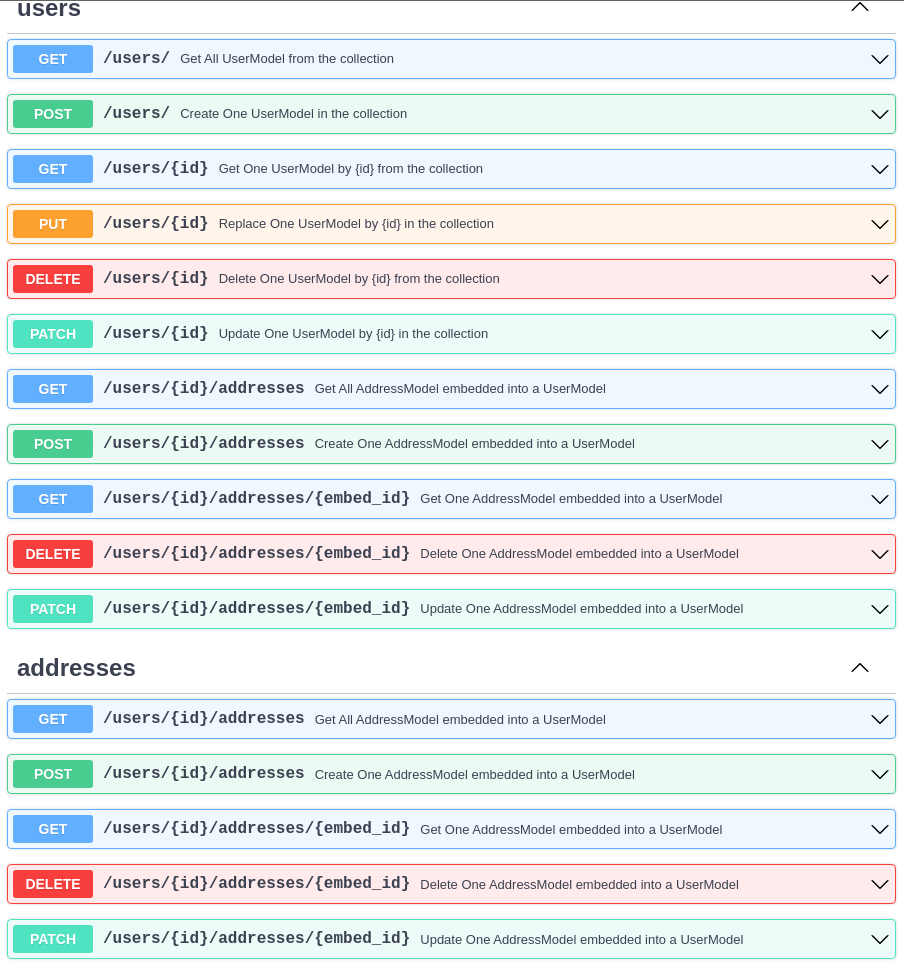

The latest addition to the CRUDRouter is the CRUDEmbed feature. It enables you to nest a model within another model, akin to a lookup but with distinct functionality. CRUDEmbed is utilized for storing a list of elements within your primary model in the collection, resembling a one-to-many relationship.

!!! question "How to use it ?"
    Unlike previous version the `embed` will not be detected automatically
    You will need to write it explicitly 

    ```py hl_lines="15 21"
    ...
    # Embed model
    class AddressModel(MongoModel):
        id: Annotated[ObjectId, MongoObjectId] | None = None
        street: str
        zip_code: str

    # Parent model
    class UserModel(MongoModel):
        id: Annotated[ObjectId, MongoObjectId] | None = None
        name: str
        addresses: Optional[list[AddressModel]] = [] # define explicitly that this field will be an embed

    # define the CRUDEmbed class
    addresses_embed = CRUDEmbed(model=AddressModel, embed_name="addresses")
    # add it to the CRUDRouter
    users_router = CRUDRouter(
    model=UserModel,
    db=db,
    collection_name="users",
    embeds=[addresses_embed],
    prefix="/users",
    tags=["users"],
    )

    ```

## Output Schema

---

You may wish to include the embed in the output schema of the base model.

!!! note "Here is how you can achieve it"
    ```py hl_lines="5"

    # Model Out -> Schema
    class UserModelOut(MongoModel):
        id: str
        name: str
        addresses: list[AddressModel] = [] # This is our embed list 

    ```


## Routes

---

The CRUDRouter will automatically add the following routes to the parent model :

| Route          | Method   | Description             |
| -------------- | -------- | ----------------------- |
| `/embeds`      | `GET`    | Get all documents       |
| `/embeds`      | `POST`   | Create a new document   |
| `/embeds/{id}` | `GET`    | Get a document by id    |
| `/embeds/{id}` | `PUT`    | Update a document by id |
| `/embeds/{id}` | `DELETE` | Delete a document by id |

## OpenAPI Result

---

But it will also add the routes above to the embed model OpenAPI schema.


